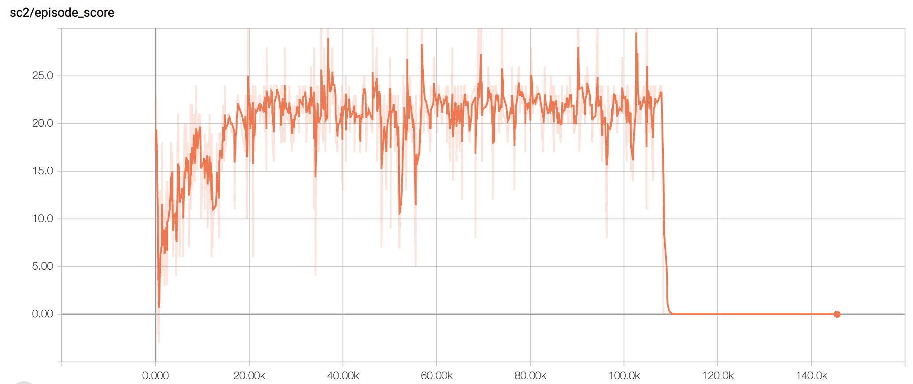

# PySC2 bot in Pytorch

## Reference:
Relies on the repo https://github.com/simonmeister/pysc2-rl-agents for implementations 
of action / observation space pre-processing, network architectures. 

Entire backend is in Pytorch, with TF for tensorboard.

## To run training:
```bash
# Overwrite existing model
python run.py --experiment_id my_experiment --envs 32 --map MoveToBeacon --overwrite
# Load existing model
python run.py --experiment_id my_experiment --envs 32 --map MoveToBeacon
```


## Result:
MoveToBeacon           |  CollectMineralShards 
:-------------------------:|:-------------------------:
  |   

FindAndDefeatZerglings 
:-------------------------: 



## TODO:
- [ ] Train on other mini-games
- [ ] Use replay data
- [ ] Optimize the Runner to work with Torch tensor instead of numpy array
- [ ] Multi-GPU training